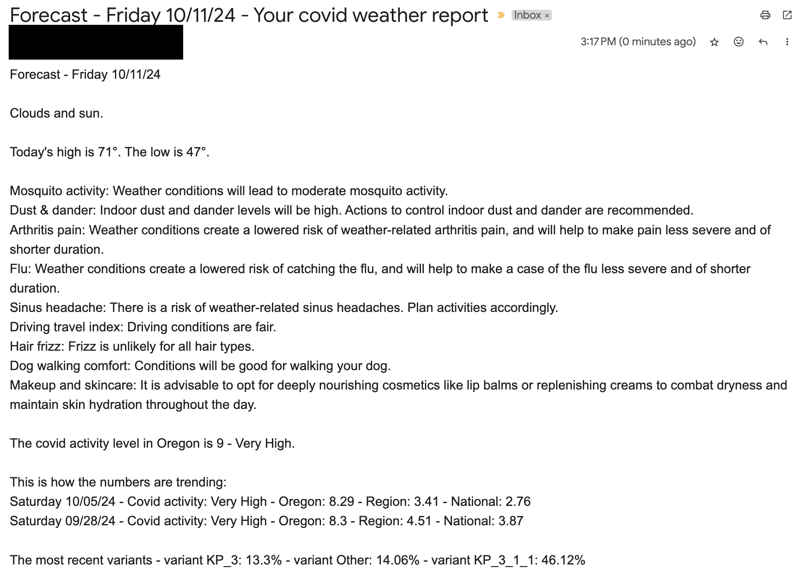

# Covid Weather Report

Welcome to my personalized covid and weather forecast.

I created this because I was frustrated by the lack of transparency around covid data. Since covid numbers appear to spike every few months, I tied this report to a daily weather report so I can keep track of the landscape and mitigate my risk.

I utilize AccuWeather for weather related information and the CDC for covid data.

This is my first pass; I am in the process of incorporating tests and doing some code cleaup.

I run this as a daily launchd job and review it as I get my day started.

In the future, I may add more detailed Flu data and include RSV numbers, but for now this is sufficient.
